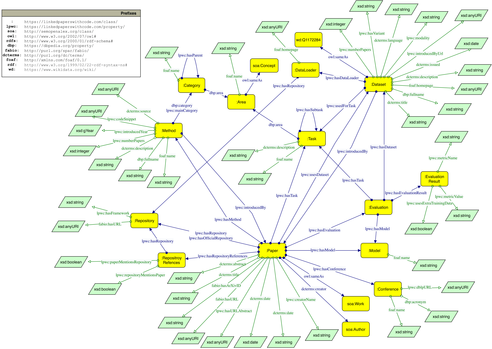

# LinkedPaperswithcode

LinkedPaperswithcode is a RDF knoweldge graph containing detailed information about machine learning papers, repositories, datasets, methods, tasks, models, evaluations and related information.

LinkedPaperswithcode is based on [Paperswithcode](https://paperswithcode.com). The underlying [dataset snapshot](https://github.com/paperswithcode/paperswithcode-data) of Paperswithcode are regenerated daily. With the scripts provided in this repository, the LinkedPaperswithcode knowledeg graph can be re-generated based on the snapshot.

<figure>
    
    <figcaption>Schema of Linked Papers With Code</figcaption>
</figure>

## Knowledge Graph Construction 

### Data transformation

### Entity Linking 

## Knowledge Graph Embeddings
